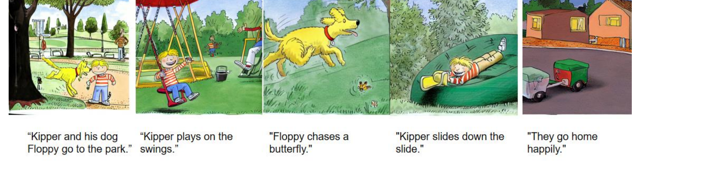

# AI Storybook Generation with ARLDM

This repository contains a cleaned portfolio version of my undergraduate thesis
project, **Story Generation Based on Diffusion Models**.

The project explored how to generate visually coherent storybook image sequences
from story text. I adapted an Auto-Regressive Latent Diffusion Model (ARLDM)
workflow to a custom Oxford Tree storybook dataset and used it to train, sample,
debug, and evaluate sequential image generation.



_Five-frame ARLDM story sequence from the thesis evaluation. The frames come
from the same story prompt sequence rather than being mixed from separate
samples._

Each story item in the dataset contains five consecutive frames. The preview
above uses the ARLDM row from my thesis evaluation to show one coherent
five-frame story sequence. The code also keeps the continuation-style sampling
setup, where internal sample outputs may be saved as four generated continuation
frames because the first frame is used as conditioning context.

## What I Built

- Built a custom Oxford Tree storybook dataset from 234 storybooks across 9
  reading levels.
- Extracted and cleaned paired image-text data from storybook PDFs.
- Converted sequential story data into HDF5 format to improve training I/O.
- Adapted the ARLDM codebase for the Oxford dataset with a custom dataset loader,
  preprocessing scripts, and training/sampling configuration.
- Tuned token length and embedding settings for longer captions and recurring
  character names.
- Ran training and sampling experiments on a GPU server.
- Compared generated story image sequences with SDXL V1.0 outputs.
- Conducted a small user survey to evaluate text-image consistency and image
  coherence.

## Project Scope

This is not a full production application. It is a cleaned research/portfolio
snapshot of the code and documentation used for my bachelor's thesis.

The repository includes the final thesis-oriented ARLDM adaptation code, Oxford
dataset loader, preprocessing scripts, configuration, documentation, and a small
representative output sequence.

It intentionally does **not** include everything from my original working
folder. The raw project folder contained duplicate experiment copies, model
caches, LLaMA2 weights, Stable Diffusion files, generated archives, HDF5 data,
server notes, administrative documents, and other materials that are not
appropriate for a public GitHub portfolio.

The raw dataset, model checkpoints, pretrained model weights, and large
generated archives are not included because they are too large and may have
copyright or distribution restrictions. The repository focuses on the code,
project structure, pipeline, and representative outputs.

## Pipeline

```text
Storybook PDFs
    -> OCR and image extraction
    -> caption cleaning and five-frame story item grouping
    -> Oxford HDF5 dataset
    -> ARLDM training
    -> five-frame story sequence generation / continuation sampling
    -> qualitative comparison and user evaluation
```

In the thesis framework, LLaMA2-7B was also used as a text-generation stage for
creating story prompts. The GitHub version focuses on the ARLDM image-generation
pipeline and does not include LLaMA2 model files or private model caches.

## Repository Structure

```text
.
├── configs/
│   └── oxford_arldm.yaml
├── docs/
│   ├── data-preparation.md
│   ├── model-pipeline.md
│   ├── project-scope.md
│   └── release-safety.md
├── examples/
│   └── generated_sequence/
├── src/
│   ├── data_script/
│   ├── datasets/
│   ├── models/
│   ├── fid_utils.py
│   └── main.py
├── NOTICE.md
├── README.md
└── requirements.txt
```

## Tech Stack

- Python
- PyTorch and PyTorch Lightning
- Hugging Face Diffusers
- CLIP and BLIP
- Hydra configuration
- OpenCV, PIL, HDF5
- GPU training with SLURM during the original thesis work

## Running the Code

This repository is not runnable out of the box because the original dataset,
model checkpoints, and pretrained model cache are not included.

To reproduce the workflow, prepare the following external assets locally:

- an Oxford-style HDF5 story dataset at `data/oxford.hdf5`
- Stable Diffusion v1.5 model files
- BLIP pretrained weights
- an ARLDM checkpoint for sampling, or GPU resources for training

Install dependencies:

```bash
pip install -r requirements.txt
```

Set model paths:

```bash
export STABLE_DIFFUSION_V1_5_PATH=/path/to/stable-diffusion-v1-5
export BLIP_PRETRAINED_PATH=/path/to/model_large.pth
export BERT_BASE_UNCASED_PATH=/path/to/bert-base-uncased
```

Run from the repository root:

```bash
python src/main.py
```

Edit `configs/oxford_arldm.yaml` to switch between `train` and `sample` mode.

## Results Summary

In the thesis evaluation, the Oxford-adapted ARLDM workflow produced more
visually coherent story sequences than SDXL V1.0 for the tested storybook-style
prompts. A small user survey with 32 participants rated the ARLDM outputs higher
than SDXL V1.0 for both text-image consistency and cross-frame coherence.

The strongest practical lesson from the project was learning how to move from
raw multimodal data to a trainable generative pipeline: data extraction,
cleaning, HDF5 conversion, model adaptation, GPU training, sampling, debugging,
and evaluation.

## Release Safety

Before making this repository public, I excluded:

- API keys, environment files, and private credentials
- personal server paths and cluster-specific node names
- raw storybook PDFs and extracted dataset files
- HDF5 datasets, checkpoints, and pretrained model weights
- LLaMA2 files and local Stable Diffusion cache
- school administrative documents and unrelated personal files

The public version is designed to be readable, safe, and interview-defensible,
not a dump of the full original working directory.

## Attribution

This work adapts the public ARLDM implementation by Pan et al. for an
undergraduate thesis project. See [NOTICE.md](NOTICE.md) for details.
